# Execution Plan

## Detailed Analysis Summary

### Transformation Scope (Brownfield Only)
- **Transformation Type**: N/A (greenfield)
- **Primary Changes**: New end-to-end video automation product
- **Related Components**: N/A

### Change Impact Assessment
- **User-facing changes**: Yes - creator-facing CLI workflow and output package quality
- **Structural changes**: Yes - multi-stage pipeline architecture with reusable artifact boundaries
- **Data model changes**: Yes - run metadata, stage manifests, artifact lineage
- **API changes**: Yes - internal stage contracts and provider integration interfaces
- **NFR impact**: Yes - cost optimization, reliability/retry, observability, persistence discoverability

### Component Relationships (Brownfield Only)
- N/A (greenfield)

### Risk Assessment
- **Risk Level**: High
- **Rollback Complexity**: Moderate
- **Testing Complexity**: Complex

## Workflow Visualization

```mermaid
flowchart TD
    Start(["User Request"])

    subgraph INCEPTION["INCEPTION PHASE"]
        WD["Workspace Detection\nCOMPLETED"]
        RE["Reverse Engineering\nSKIP"]
        RA["Requirements Analysis\nCOMPLETED"]
        US["User Stories\nCOMPLETED"]
        WP["Workflow Planning\nCOMPLETED"]
        AD["Application Design\nEXECUTE"]
        UP["Units Planning\nEXECUTE"]
        UG["Units Generation\nEXECUTE"]
    end

    subgraph CONSTRUCTION["CONSTRUCTION PHASE"]
        FD["Functional Design\nEXECUTE"]
        NFRA["NFR Requirements\nEXECUTE"]
        NFRD["NFR Design\nEXECUTE"]
        ID["Infrastructure Design\nEXECUTE"]
        CG["Code Generation\nEXECUTE"]
        BT["Build and Test\nEXECUTE"]
    end

    subgraph OPERATIONS["OPERATIONS PHASE"]
        OPS["Operations\nPLACEHOLDER"]
    end

    Start --> WD
    WD --> RA
    RA --> US
    US --> WP
    WP --> AD
    AD --> UP
    UP --> UG
    UG --> FD
    FD --> NFRA
    NFRA --> NFRD
    NFRD --> ID
    ID --> CG
    CG --> BT
    BT --> End(["Complete"])

    style WD fill:#4CAF50,stroke:#1B5E20,stroke-width:3px,color:#fff
    style RA fill:#4CAF50,stroke:#1B5E20,stroke-width:3px,color:#fff
    style US fill:#4CAF50,stroke:#1B5E20,stroke-width:3px,color:#fff
    style WP fill:#4CAF50,stroke:#1B5E20,stroke-width:3px,color:#fff
    style RE fill:#BDBDBD,stroke:#424242,stroke-width:2px,stroke-dasharray: 5 5,color:#000

    style AD fill:#FFA726,stroke:#E65100,stroke-width:3px,stroke-dasharray: 5 5,color:#000
    style UP fill:#FFA726,stroke:#E65100,stroke-width:3px,stroke-dasharray: 5 5,color:#000
    style UG fill:#FFA726,stroke:#E65100,stroke-width:3px,stroke-dasharray: 5 5,color:#000
    style FD fill:#FFA726,stroke:#E65100,stroke-width:3px,stroke-dasharray: 5 5,color:#000
    style NFRA fill:#FFA726,stroke:#E65100,stroke-width:3px,stroke-dasharray: 5 5,color:#000
    style NFRD fill:#FFA726,stroke:#E65100,stroke-width:3px,stroke-dasharray: 5 5,color:#000
    style ID fill:#FFA726,stroke:#E65100,stroke-width:3px,stroke-dasharray: 5 5,color:#000

    style CG fill:#4CAF50,stroke:#1B5E20,stroke-width:3px,color:#fff
    style BT fill:#4CAF50,stroke:#1B5E20,stroke-width:3px,color:#fff
    style OPS fill:#BDBDBD,stroke:#424242,stroke-width:2px,stroke-dasharray: 5 5,color:#000

    style INCEPTION fill:#BBDEFB,stroke:#1565C0,stroke-width:3px,color:#000
    style CONSTRUCTION fill:#C8E6C9,stroke:#2E7D32,stroke-width:3px,color:#000
    style OPERATIONS fill:#FFF59D,stroke:#F57F17,stroke-width:3px,color:#000
    style Start fill:#CE93D8,stroke:#6A1B9A,stroke-width:3px,color:#000
    style End fill:#CE93D8,stroke:#6A1B9A,stroke-width:3px,color:#000

    linkStyle default stroke:#333,stroke-width:2px
```

### Text Alternative
- Inception complete so far: Workspace Detection, Requirements Analysis, User Stories, Workflow Planning
- Inception remaining to execute: Application Design, Units Planning, Units Generation
- Construction planned to execute: Functional Design, NFR Requirements, NFR Design, Infrastructure Design, Code Generation, Build and Test
- Operations: Placeholder (not executed in current workflow)

## Phases to Execute

### INCEPTION PHASE
- [x] Workspace Detection (COMPLETED)
- [x] Reverse Engineering (SKIPPED)
  - **Rationale**: Greenfield workspace with no existing code
- [x] Requirements Analysis (COMPLETED)
- [x] User Stories (COMPLETED)
- [x] Workflow Planning (COMPLETED)
- [ ] Application Design - EXECUTE
  - **Rationale**: New services/components and interaction contracts need explicit design
- [ ] Units Planning - EXECUTE
  - **Rationale**: Complex scope requires decomposition and dependency ordering
- [ ] Units Generation - EXECUTE
  - **Rationale**: Multiple units needed for safe parallel construction

### CONSTRUCTION PHASE
- [ ] Functional Design - EXECUTE
  - **Rationale**: Complex business rules and transformations require detailed functional design
- [ ] NFR Requirements - EXECUTE
  - **Rationale**: Cost, reliability, observability, and persistence constraints are explicit
- [ ] NFR Design - EXECUTE
  - **Rationale**: NFR patterns must be integrated into architecture before coding
- [ ] Infrastructure Design - EXECUTE
  - **Rationale**: Multi-stage orchestration and artifact persistence require infrastructure mapping
- [ ] Code Generation - EXECUTE (ALWAYS)
  - **Rationale**: Implementation planning and generation is mandatory
- [ ] Build and Test - EXECUTE (ALWAYS)
  - **Rationale**: Verification and quality gates are mandatory

### OPERATIONS PHASE
- [ ] Operations - PLACEHOLDER
  - **Rationale**: Future workflow stage only

## Package Change Sequence (Brownfield Only)
- N/A (greenfield)

## Estimated Timeline
- **Total Stages**: 9 (4 completed, 5 pending execution)
- **Estimated Duration**: 6-10 working days depending on provider integration complexity

## Success Criteria
- **Primary Goal**: End-to-end CLI-driven generation of platform-ready short-form video packages using free-tier services
- **Key Deliverables**:
  - Application and unit designs
  - Unit-level implementation with persistence and reuse guarantees
  - Build/test instruction suite and verification artifacts
- **Quality Gates**:
  - All stage outputs persisted and indexed via manifest
  - Retry/resume behavior validated
  - Platform packaging validation passes for TikTok, Shorts, and Reels
  - Automated test suite and build instructions complete

## Extension Rule Compliance Summary (Workflow Planning Stage)
- **Security Baseline**: N/A (disabled in extension configuration)
- **Property-Based Testing (Partial)**: N/A at this stage; enforcement begins in later design and testing stages
